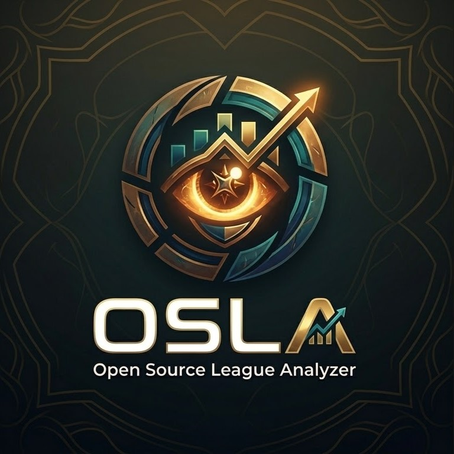

# Open Source League Analyzer (OSLA)

This repository contains code for OSLA, application for analyzing player statistics in League of Legends based on their in-game performance.

  

example logo created with Google Nano Banana 2 
