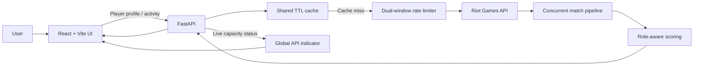

# Open League Analyzer

<p align="center">
  
</p>

<p align="center">
  A full-stack League of Legends analytics application that turns raw Riot match data into clear, role-aware performance insights.
</p>

<p align="center">
  <strong>React 19</strong> · <strong>FastAPI</strong> · <strong>Python</strong> · <strong>Tailwind CSS</strong> · <strong>Docker</strong> · <strong>Riot Games API</strong>
</p>

---

## Why I built this

Most match-history applications stop at displaying kills, deaths, assists, and rank. Open League Analyzer asks a more useful question:

> **How well did a player perform relative to other players in the same role?**

The application fetches live Riot data, normalizes performance by position, calculates a weighted percentile score, and presents the result through an interactive player profile and match breakdown.

The interesting part of this project is not only the UI. It is the engineering around a constrained third-party API: concurrent requests, two overlapping rate-limit windows, retries, caching, progressive loading, and keeping the interface responsive while the backend processes dozens of matches.

## What the application does

### Player intelligence

- Search by Riot ID and platform.
- Display rank, LP, win rate, profile level, and champion masteries.
- Explore recent ranked matches with expandable pagination in batches of 20.
- Visualize activity across a 91-day heatmap.
- Discover recurring duo partners and their shared win rate.
- Compare average KDA, CS, kill participation, and communication patterns.
- Inspect performance distribution using average, median, and standard deviation.

### Match analysis

- Inspect both teams and every participant in a selected match.
- Compare builds, runes, summoner spells, KDA, and match outcome.
- Highlight the strongest performer on each team.
- Assign every player a role-aware performance score and quality band.

### Production-minded API handling

- Enforce both short- and long-window Riot API limits globally.
- Cache immutable match payloads and frequently reused account metadata.
- Retry transient failures and `429` responses with bounded exponential backoff.
- Respect Riot's `Retry-After` response header.
- Surface live API capacity in every application route without consuming Riot quota.
- Cancel stale frontend requests when the viewed player changes.

## Performance scoring

Open League Analyzer computes a score locally—there is no opaque external model involved.

For every participant, the backend extracts signals including:

- combat efficiency and kill participation,
- damage and gold per minute,
- vision activity,
- farming and map pressure,
- objective and turret damage,
- crowd control, solo kills, damage share, and survival.

Players are grouped by their in-game role. Each feature is standardized within that role, combined using explicit weights, and converted into a percentile. The result is presented as one of four readable bands:

| Percentile | Band |
|---:|---|
| 80–100 | Elite |
| 60–79 | Strong |
| 40–59 | Solid |
| 0–39 | Low |

This avoids comparing fundamentally different responsibilities—for example, a support is evaluated against other supports rather than against an ADC.

## Architecture



### Request strategy

The initial profile request prioritizes the first 20 matches so the useful part of the page appears quickly. A lightweight activity endpoint fetches only the dates required by the heatmap, skipping rank, mastery, participant mapping, and statistical summarization.

Additional full match pages are loaded only when the user selects **Show More**. Previously fetched Riot payloads are reused from the backend cache.

### Rate-limit strategy

The development key allows 20 requests per second and 100 requests per two minutes. The application deliberately keeps safety headroom:

```text
18 requests / second
90 requests / 120 seconds
```

A thread-safe sliding-window limiter is shared by all backend requests. The frontend reads a separate local status endpoint once per second; this endpoint reports capacity without making another Riot API call. When capacity is low, the UI shows a live reset countdown and automatically returns to a green **Free to go** state after recovery.

### Cache strategy

| Resource | Cache lifetime | Reason |
|---|---:|---|
| Riot ID → PUUID | 24 hours | Account identity rarely changes |
| Recent match ID list | 2 minutes | Keeps history fresh |
| Match payload | 30 days | Completed matches are immutable |
| Ranked metadata | 5 minutes | LP and rank change frequently |
| Champion mastery | 30 minutes | Useful but not time-critical |

## Technology choices

| Layer | Technology | Why |
|---|---|---|
| Frontend | React 19, React Router | Component-driven UI and client-side routing |
| Styling | Tailwind CSS 4 | Responsive design with a consistent visual system |
| Build tooling | Vite 8 | Fast development feedback and optimized builds |
| Backend | FastAPI, Python 3.12 | Typed endpoints and straightforward data pipelines |
| HTTP client | Requests | Mature Riot API integration and session pooling |
| Concurrency | ThreadPoolExecutor | Parallel match retrieval for an I/O-bound workload |
| Deployment | Docker Compose | Reproducible frontend/backend environment |

## Running locally

### Requirements

- [Docker Desktop](https://www.docker.com/products/docker-desktop/)
- A valid key from the [Riot Developer Portal](https://developer.riotgames.com/)

### 1. Configure the API key

Create a `.env` file in the repository root:

```env
RIOT_API_KEY=RGAPI-your-key-here
```

The key stays on the backend and is never sent to the browser.

### 2. Start the application

```bash
docker compose up --build
```

Open:

- Application: [http://localhost:5173](http://localhost:5173)
- FastAPI documentation: [http://localhost:8000/docs](http://localhost:8000/docs)

Stop the stack with `Ctrl+C`, then remove the containers with:

```bash
docker compose down
```

## API overview

| Method | Endpoint | Purpose |
|---|---|---|
| `GET` | `/api/matches/{platform}/{name}/{tag}` | Full player and match analysis |
| `GET` | `/api/activity/{platform}/{name}/{tag}` | Lightweight heatmap data |
| `GET` | `/api/rate-limit` | Current local limiter capacity |
| `GET` | `/docs` | Interactive OpenAPI documentation |

Example:

```text
GET /api/matches/EUW/PlayerName/EUW?count=20&start=0&save=false
```

## Repository structure

```text
.
├── data/static/                  # Data Dragon lookup tables and UI assets
├── src/
│   ├── BACKEND/
│   │   ├── main.py              # FastAPI routes and response metadata
│   │   ├── model.py             # Riot models and performance scoring
│   │   ├── pipeline.py          # Full and lightweight data pipelines
│   │   └── riot_api.py          # Cache, limiter, retries, and transport
│   └── FRONTEND/
│       ├── src/components/      # Shared interface components
│       ├── src/pages/           # Routed application views
│       └── src/services/api.js  # Frontend API and status integration
├── docker-compose.yml
└── README.md
```

## Engineering decisions and trade-offs

- **In-memory cache over Redis:** ideal for a portfolio-scale single backend process and zero-configuration local startup. A multi-instance deployment would move the cache and limiter state to Redis.
- **Explicit scoring over a black-box model:** makes every metric inspectable and easy to iterate on. A future version can validate the weights against larger ranked datasets.
- **Progressive loading over one large response:** improves time-to-first-useful-content and lets the user decide whether more match data is worth fetching.
- **Safety margin below Riot limits:** slightly reduces peak throughput but avoids turning normal multi-user traffic into repeated `429` failures.

## What I would build next

1. Move rate-limit and cache state to Redis for horizontally scaled workers.
2. Add contract tests around Riot responses and end-to-end tests for profile pagination.
3. Persist historical snapshots to compare player development over time.
4. Validate performance weights against larger role- and rank-specific datasets.
5. Add observability for cache hit rate, upstream latency, and quota consumption.
6. Deploy a public demo with managed secrets and scheduled key-health checks.

## Author

Built as a full-stack portfolio project to demonstrate API integration, backend data modeling, concurrency control, responsive frontend development, and practical engineering trade-offs.

If you are reviewing this project as an engineer or recruiter, I would be happy to discuss the architecture, scoring model, or the decisions behind the rate-limit strategy.
